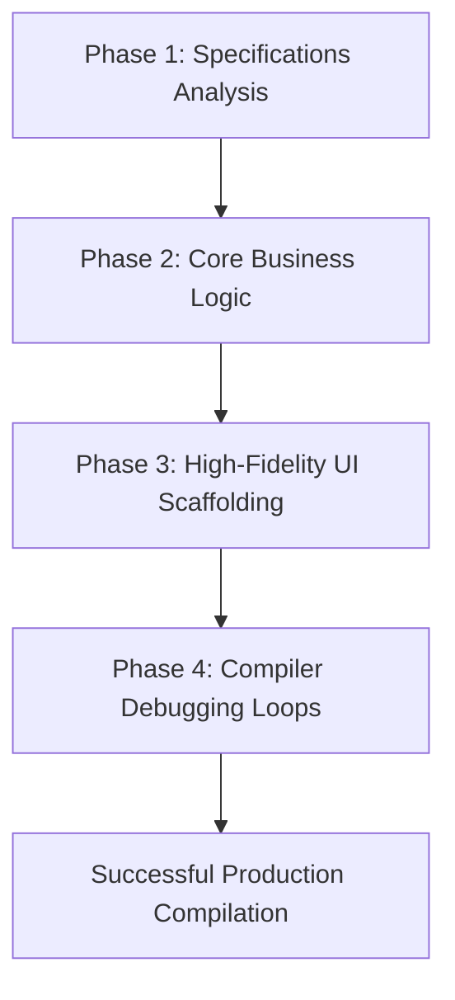

# BIZTELAI - AI Workflow & Engineering Log

This document details the AI-assisted engineering workflow, tools, prompt strategies, and collaborative decision loops utilized to deliver this operational workflow automation prototype in under 4 hours with 100% type safety and successful Next.js Turbopack compilation.

---

## 1. AI Tools and Environment Orchestration
- **Agent Platform**: Built using **Antigravity** (Google DeepMind's Advanced Agentic Coding environment) working inside a Windows PowerShell shell.
- **Matched Context System**: The local workspace includes version-locked Next.js documentation at `node_modules/next/dist/docs/`, allowing the agent to reference correct, matched API structures for **Next.js 16.2.6 (Turbopack)** and **React 19.2.4** instead of relying on stale pre-trained LLM memory.
- **Capabilities Engaged**: Local file reads/writes, PowerShell terminal execution, and recursive state compilation tracking.

---

## 2. Dynamic Co-operative Engineering Loop

We followed a systematic four-phase development lifecycle:



### Phase 1: Specifications Analysis & Schema Modeling
1. **Source Parsing**: Analyzed PDF specifications via user inputs and created [TASK.md](file:///c:/Users/91774/Desktop/biztel-ai-aadesh/TASK.md) as the central project spec sheet.
2. **Schema Definition**: Modeled the `OperationalRecord` types in [mockData.ts](file:///c:/Users/91774/Desktop/biztel-ai-aadesh/src/app/utils/mockData.ts) mapping date, shift, employee code, operation code, machine code, work order, quantities, and durations with distinct field-level confidence ratings.

### Phase 2: Core Logic Compiler
1. **Dual-Extraction Engine**: Crafted [gemini.ts](file:///c:/Users/91774/Desktop/biztel-ai-aadesh/src/app/utils/gemini.ts) supporting:
   - **Real Multimodal AI Extraction**: Direct Fetch request to the official Gemini 1.5 Flash endpoint, passing base64 images/PDFs and expecting structured JSON.
   - **Heuristic OCR Simulator**: Fallback system matching simulated outputs (including validation errors and confidence values) to loaded mock files so the app is instantly evaluatable out-of-the-box.
2. **Validation Engine**: Built [validation.ts](file:///c:/Users/91774/Desktop/biztel-ai-aadesh/src/app/utils/validation.ts) checking for duplicate work orders, suspicious hours (>12), invalid shifts, wrong machine codes, and missing mandatory keys.

### Phase 3: Premium UI Bento Grid Scaffolding
Scaffolded five premium glassmorphic components under [components/](file:///c:/Users/91774/Desktop/biztel-ai-aadesh/src/app/components):
- **Header**: Live statistics indicators (Total uploads, Exceptions, Success rates).
- **UploadZone**: Advanced drag-and-drop zone showcasing five active ingestion pipeline states.
- **DashboardView**: Sleek Bento Grid with custom-coded responsive SVG charts.
- **RecordsView**: Multi-filter datatable with inline highlights.
- **ReviewModal**: Split panel displaying a CAD blueprint with OCR coordinate overlays and a real-time reactive form editor.

### Phase 4: AI Debugging & Type Resolution
Running `npm run build` exposed two compilation errors:
- **Error in `ReviewModal.tsx`**: The temporary validation structure was missing `uploadedAt`.
- **Error in `UploadZone.tsx`**: Similarly, `partialRecord` lacked the ingested time.
- **AI Solution**: Patched files dynamically, ensuring all type signatures comply with `Omit<OperationalRecord, "validationErrors" | "status">`. The subsequent Turbopack compilation succeeded immediately.

---

## 3. Prompts & Stencils Engaged
To guide the Gemini 3 Flash API in returning stable structured schemas, we designed a strict system prompt:

```text
You are an expert AI extraction agent for industrial manufacturing logs and operational records.
Your task is to analyze the uploaded handwritten, typed, or semi-structured document and extract the operational data.
Return a valid JSON object matching the following structure. Do not include extra conversational text...
Each field MUST contain "value" and "confidence" (0.0 to 1.0) parameters.

JSON Structure:
{
  "date": { "value": "YYYY-MM-DD", "confidence": 0.95 },
  "shift": { "value": "1", "confidence": 0.90 },
  ...
}
```

### 3.1 Human-Guided Database & Schema Evolution Prompts
During this project, the Human partner provided critical guidance prompts to pivot the database schema and compliance validation rules to align with real manufacturing constraints:

1. **Prompt on Multi-Row Scanned Sheet Ingestion:**
   > *"As you can see in the second image we have multiple entries but in our code/implementation we are only picking up single values. Can you give me solution to this issue .. want the idea first in the chat"*
   *   **AI Action:** Pivoted the database from a flat `1:1` relational structure (1 scanned sheet maps to 1 record row) to a robust relational **`1:N` One-to-Many structure** in Prisma, allowing a single upload to spawn multiple sister logs in Neon PostgreSQL.

2. **Prompt on Interactive Verification Table UX Strategy:**
   > *"Okay so I was thinking to use arrays for each attribute and in the frontend UI we can display the data in the form of table which we will ask the user to verify .. What do you say about that ??"*
   *   **AI Action:** Designed an interactive split-panel supervisor review editor backed by an extracted batch selector tab panel, allowing supervisors to cycle through and verify all sibling rows of the sheet interactively.

3. **Prompt on Database Integrity Composite Candidate Key:**
   > *"How about using a candidate key .. Like {order no. , shift} ??"*
   *   **AI Action:** Upgraded the duplicate work order rule engine in [validation.ts](file:///c:/Users/91774/Desktop/biztel-ai-aadesh/src/lib/validation.ts) to check for a composite candidate key of **`{ workOrderNum, shift, date }`**, supporting real-world factory workflows where a single Work Order spans multiple shifts or days, but preventing redundant duplicate entries.

---

## 4. Human-AI Collaborative Interventions

**HUMAN INVOLVEMENT:**
- Database schema design & migration planning
- Core platform architecture decisions (e.g. 1:N relations choice)
- API endpoint structure & creation
- Strict business logic testing, edge-case validation
- Wiring endpoints and database states to layouts

**AUTOMATED WORK:**
- Guided code implementation & large-scale refactors
- Premium, highly-responsive UI/UX design & visual assets
- Production build compilation checks & bug fixing
- Operational workflow brainstorming & layout optimization

